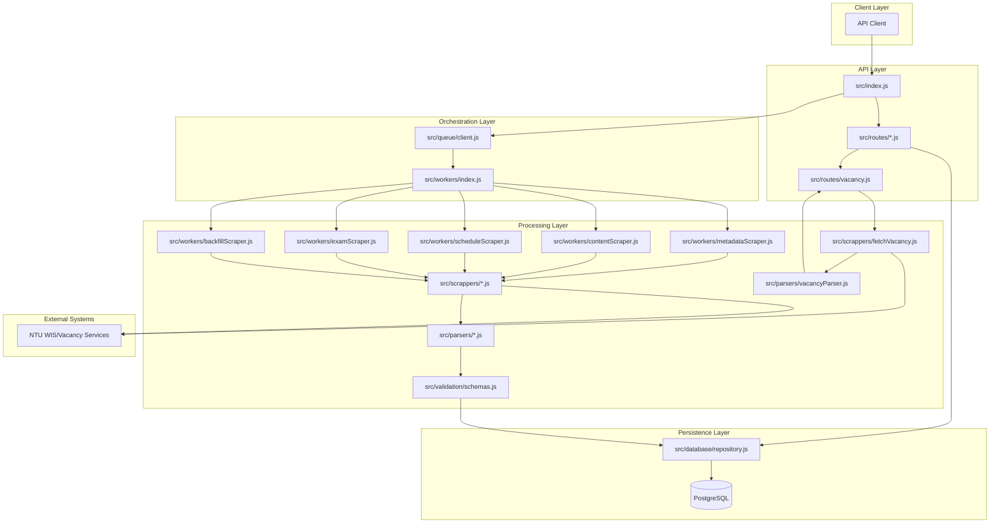

# NTU Public APIs - Code Architecture

This document is a standalone architecture view of the codebase.  
It summarizes the runtime design, module boundaries, and data flow currently implemented in `src/`.

## 1. Architecture Summary

The service has two main execution paths:

1. Background scrape pipeline (queue-driven):
   NTU endpoints -> scrappers -> parsers -> Zod validation -> repository -> PostgreSQL
2. API access pipeline (request-driven):
   Client -> Express routes -> repository -> PostgreSQL (plus legacy debug scrape routes)

There is one special live path:

3. Real-time vacancy pipeline:
   Client -> `/vacancy` route -> NTU vacancy endpoint -> vacancy parser -> JSON response (no DB persistence)

## 2. High-Level Component Diagram



## 3. Runtime Layers and Responsibilities

| Layer | Key Files | Responsibility |
|---|---|---|
| API Layer | `src/index.js`, `src/routes/*.js` | HTTP server, request routing, error responses, Swagger docs, legacy manual scrape routes |
| Queue Layer | `src/queue/client.js` | BullMQ queue + worker lifecycle (Redis-backed) |
| Worker Layer | `src/workers/*.js` | Orchestrates Fetch -> Parse -> Validate -> Persist |
| Scraper Layer | `src/scrappers/*.js` | HTTP calls only; returns raw HTML/text |
| Parser Layer | `src/parsers/*.js` | Extracts structured objects from raw HTML |
| Validation Layer | `src/validation/schemas.js` | Zod schemas for payload validation |
| Persistence Layer | `src/database/repository.js`, `src/database/client.js` | Read/write DB access patterns |
| Schema Init | `src/database/init.js` | Creates schema/tables on startup |
| Utility Layer | `src/utils/logger.js`, `src/utils/format.js` | Logging and academic semester normalization |

## 4. Startup and Orchestration

### 4.1 API Process Startup (`src/index.js`)

On startup, the app performs:

1. `clearQueue()` to reset BullMQ jobs.
2. `initDatabase()` to create tables.
3. `startWorkers()` to begin queue consumption.
4. `addJob('scrape-metadata', { triggerNext: true })` to bootstrap scraping.
5. Starts Express listener.

### 4.2 Optional Cron Scheduler (`src/scheduler/cron.js`)

`startScheduler()` triggers hourly `scrape-metadata` jobs.  
This scheduler is a separate module and is not auto-started by `src/index.js`.

## 5. Job Types and Worker Dispatch

`src/workers/index.js` dispatches queue jobs by name:

- `scrape-metadata` -> `metadataScraper`
- `scrape-content` -> `contentScraper`
- `scrape-schedule` -> `scheduleScraper`
- `scrape-exam` -> `examScraper`
- `scrape-backfill` -> `backfillScraper`

Metadata scraping fans out downstream jobs for the latest 2 academic years, then schedules delayed backfill checks.

## 6. Data Flow Details

### 6.1 Background Scrape Flow

1. Metadata worker fetches semester options from schedule/content forms.
2. Metadata is normalized (`YYYY_S`) and saved to `semester_metadata`.
3. Metadata worker enqueues content/schedule/exam jobs for target years.
4. Content/schedule/exam workers fetch raw HTML via dedicated scrapers.
5. Parsers extract structured arrays.
6. Zod validates parsed payloads for content/schedule/exam/vacancy paths.
7. Repository persists into source-specific tables (metadata is normalized and saved directly by worker logic).
8. Backfill worker compares coverage and fills missing content/schedule records.

### 6.2 Read API Flow

1. Request enters route handler.
2. Route parses filters/pagination.
3. Repository executes SQL query.
4. JSON result returned (`{ total, count, rows }` shape for list endpoints).

### 6.3 Live Vacancy Flow (No Database)

1. `/vacancy` validates `course_code` (and optional `index`).
2. `fetchVacancy()` calls NTU vacancy endpoint directly.
3. `parseVacancyHtml()` extracts indexes/classes from response HTML.
4. Route validates response with Zod and returns live data.
5. No vacancy data is persisted in PostgreSQL.

## 7. Persistence Model

Tables initialized in `src/database/init.js`:

- `semester_metadata`
- `course_content`
- `course_schedule`
- `exam_timetable`

Persistence strategies in `src/database/repository.js`:

- Metadata: upsert on `(year, semester)`.
- Course content: upsert on `(course_code, acadsem)`.
- Course schedule: per-course delete then insert (refresh model).
- Exam timetable: upsert on `(course_code, acadsem, student_type)`.

This matches the project rule of source-oriented storage with clear table ownership per scraper domain.

## 8. Directory-Level Architecture Map

```text
src/
  index.js                  # App bootstrap + route mounting + initial scrape trigger
  routes/                   # API endpoints (read APIs + live vacancy endpoint)
  workers/                  # Queue job orchestration logic
  queue/                    # BullMQ/Redis queue client + worker creation
  scrappers/                # Raw HTTP fetchers for NTU endpoints
  parsers/                  # HTML-to-JSON extraction logic
  validation/               # Zod schemas
  database/                 # DB connection, schema init, repository queries
  scheduler/                # Optional cron trigger module
  utils/                    # Logging and formatting helpers
```

## 9. Architectural Characteristics

- Decoupled async ingestion via BullMQ workers.
- Clear separation of concerns between fetching and parsing.
- Validation boundary before persistence on core scrape/response paths (Zod).
- Primary public endpoints are read-only over persisted datasets; legacy manual scrape routes also exist.
- Real-time vacancy endpoint intentionally bypasses database storage.
- Backfill mechanism to improve dataset completeness.
