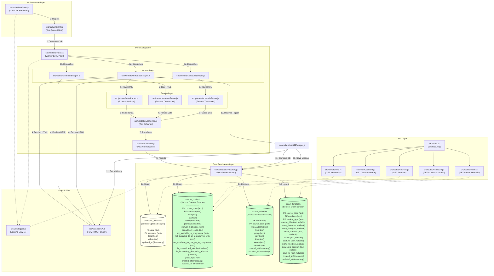

# NTU Course API

A comprehensive, production-ready REST API service for Nanyang Technological University (NTU) course data, providing detailed information on course content, class schedules, exam timetables, real-time vacancy checks, and academic metadata.

[](https://github.com/Jared0024/NTU-Public-APIs)
[](https://nodejs.org/)
[](LICENSE)

---

## Table of Contents

- [Features](#-features)
- [Quick Start](#-quick-start)
- [API Reference](#-api-reference)
  - [Course Content](#1-course-content)
  - [Course Schedules](#2-course-schedules)
  - [Course Directory](#3-course-directory)
  - [Exam Timetables](#4-exam-timetables)
  - [Real-Time Vacancy Check](#5-real-time-vacancy-check)
  - [Semester Metadata](#6-semester-metadata)
  - [Health Check](#7-health-check)
- [Response Formats](#-response-formats)
- [Error Handling](#-error-handling)
- [Installation & Setup](#-installation--setup)
- [Configuration](#-configuration)
- [Architecture](#-architecture)
- [How The Scraper Works](#-how-the-scraper-works)
- [Development](#-development)
- [Testing](#-testing)

---

## Features

### Core Capabilities
- **Comprehensive Course Data** - Full course details including descriptions, prerequisites, restrictions, and academic units
- **Class Schedules** - Complete timetables with venues, groups, and session types
- **Exam Information** - Exam dates, times, venues, and types (Open Book, Closed Book, Restricted)
- **Real-Time Vacancy** - Live availability and waitlist data directly from NTU Vacancy Service (no database storage)
- **Automated Updates** - Scheduled hourly scraping keeps data fresh
- **Smart Pagination** - Efficient data retrieval with customizable limits and offsets
- **Flexible Filtering** - Query by course code, semester, student type, and more

### Technical Highlights
- **Event-Driven Architecture** - Redis-backed job queue (BullMQ) for scalable processing
- **Data Integrity** - Upsert strategy preserves history while updating current data
- **NULL Semantics** - Proper distinction between unknown and empty data
- **Live Data Access** - Direct integration with NTU Vacancy Service for real-time vacancy information
- **Interactive Docs** - Swagger UI for API exploration and testing
- **Well-Tested** - 66 passing tests with comprehensive coverage
- **Docker Ready** - Easy containerized deployment

---

## Quick Start

### Prerequisites
- Node.js (v18+)
- PostgreSQL (v13+)
- Redis (v6+)

### Installation

```bash
# Clone the repository
git clone https://github.com/Jared0024/NTU-Public-APIs.git
cd NTU-Public-APIs

# Install dependencies
npm install

# Configure environment variables
cp .env.example .env
# Edit .env with your database credentials

# Start the server
npm run dev
```

### Docker Quick Start

```bash
# Start PostgreSQL
docker run --name ntu-postgres -e POSTGRES_PASSWORD=ntu -e POSTGRES_DB=ntu_api -p 5432:5432 -d postgres:16

# Start Redis
docker run --name ntu-redis -p 6379:6379 -d redis:latest

# Start the API
npm run dev
```

**Access the API:**
- API Endpoints: `http://localhost:3000`
- Interactive Docs: `http://localhost:3000/api-docs`

---

## API Reference

Base URL: `http://localhost:3000`

### 1. Course Content

Get detailed course information including descriptions, prerequisites, restrictions, and metadata.

#### Endpoint
```http
GET /course-content
```

#### Query Parameters

| Parameter | Type | Default | Max | Description |
|-----------|------|---------|-----|-------------|
| `course_code` | string | - | - | Filter by specific course code (e.g., `SC2008`) |
| `acadsem` | string | - | - | Filter by semester in `YYYY_S` format (e.g., `2025_2`) |
| `limit` | integer | 100 | 500 | Number of records to return |
| `offset` | integer | 0 | - | Number of records to skip (for pagination) |

#### Response Fields

| Field | Type | Description |
|-------|------|-------------|
| `course_code` | string | Unique course identifier (e.g., "SC2008") |
| `acadsem` | string | Academic semester in YYYY_S format (e.g., "2025_2") |
| `title` | string | Full course title |
| `au` | number | Academic Units (credit hours). Can be 0.0 for non-credit courses |
| `description` | string | Detailed course description and objectives |
| `prerequisites` | string | Required courses or conditions (e.g., "SC1004 & SC2000 OR MH2802 & SC2000") |
| `mutual_exclusions` | string | Courses that cannot be taken together (e.g., "CE3005, CZ3006") |
| `department_code` | string | Department/school code (e.g., "CSC(CE)") |
| `not_available_to_programme` | string | Programmes that cannot take this course (e.g., "EEE, ENG(EEE)") |
| `not_available_to_all_programme_with` | string | Programme restrictions with specific admission year conditions |
| `not_available_as_bde_ue_to_programme` | string | Programmes that cannot take this as BDE/UE elective (e.g., "BCE") |
| `is_unrestricted_elective` | boolean | `true` = Offered as Unrestricted Elective, `false` = Not offered as UE |
| `is_broadening_deepening_elective` | boolean | `true` = Offered as Broadening and Deepening Elective, `false` = Not offered as BDE |
| `grade_type` | string | Grading scheme (e.g., "Letter Grade", "Pass/Fail") |
| `created_at` | string | ISO 8601 timestamp of first record creation |
| `updated_at` | string | ISO 8601 timestamp of last update |

#### Example Request

```bash
# Get SC2008 for Semester 2, 2025-2026
curl "http://localhost:3000/course-content?course_code=SC2008&acadsem=2025_2"

# Get all courses for Semester 1, 2025-2026 with pagination
curl "http://localhost:3000/course-content?acadsem=2025_1&limit=50&offset=0"

# Get all courses (paginated)
curl "http://localhost:3000/course-content?limit=100&offset=0"
```

#### Example Response

```json
{
  "total": 1,
  "count": 1,
  "rows": [
    {
      "course_code": "SC2008",
      "acadsem": "2025_2",
      "title": "COMPUTER NETWORK",
      "au": 3.0,
      "description": "This course serves as a foundation for computer and communication networks. Emphasis is placed on concepts, protocols and technologies...",
      "prerequisites": "SC1004 & SC2000 OR MH2802 & SC2000",
      "mutual_exclusions": "CE3005, CZ3006",
      "department_code": "CSC(CE)",
      "not_available_to_programme": "EEE, EEE 1, ENG(EEE)",
      "not_available_to_all_programme_with": "(Admyr 2011-2020)",
      "not_available_as_bde_ue_to_programme": "BCE",
      "is_unrestricted_elective": false,
      "is_broadening_deepening_elective": true,
      "grade_type": "Letter Grade",
      "created_at": "2025-12-07T10:30:00.000Z",
      "updated_at": "2025-12-08T02:24:17.000Z"
    }
  ]
}
```

---

### 2. Course Schedules

Get class timetables including lecture, tutorial, and lab sessions with venues and timing.

#### Endpoint
```http
GET /course-schedule
```

#### Query Parameters

| Parameter | Type | Default | Max | Description |
|-----------|------|---------|-----|-------------|
| `course_code` | string | - | - | Filter by course code |
| `acadsem` | string | - | - | Filter by semester (YYYY_S format) |
| `limit` | integer | 100 | 500 | Number of records to return |
| `offset` | integer | 0 | - | Number of records to skip |

#### Response Fields

| Field | Type | Description |
|-------|------|-------------|
| `index` | string | Course index number for registration (e.g., "10284") |
| `course_code` | string | Course identifier |
| `acadsem` | string | Academic semester (YYYY_S format) |
| `type` | string | Session type: `LEC` (Lecture), `TUT` (Tutorial), `LAB` (Laboratory), `SEM` (Seminar), or combined |
| `group` | string | Group/section identifier (e.g., "L1", "T01") |
| `day` | string | Day of week: `MON`, `TUE`, `WED`, `THU`, `FRI`, `SAT` |
| `time` | string | Time range in 24-hour format (e.g., "0930-1120") |
| `venue` | string | Location code (e.g., "LT19A", "N4-02a-03") |
| `remark` | string | Additional notes or teaching weeks |
| `created_at` | string | ISO 8601 timestamp |
| `updated_at` | string | ISO 8601 timestamp |

#### Example Request

```bash
# Get all schedules for SC2008 in Semester 2, 2025-2026
curl "http://localhost:3000/course-schedule?course_code=SC2008&acadsem=2025_2"

# Get all schedules for a specific index
curl "http://localhost:3000/course-schedule?acadsem=2025_2&limit=500" | jq '.rows[] | select(.index == "10284")'
```

#### Example Response

```json
{
  "total": 5,
  "count": 5,
  "rows": [
    {
      "index": "10284",
      "course_code": "SC2008",
      "acadsem": "2025_2",
      "type": "LEC/STUDIO",
      "group": "LE1",
      "day": "TUE",
      "time": "0830-0920",
      "venue": "LT2A",
      "remark": "Teaching Wk2,4,6,8,10,12",
      "created_at": "2025-12-08T02:24:17.000Z",
      "updated_at": "2025-12-08T02:24:17.000Z"
    },
    {
      "index": "10284",
      "course_code": "SC2008",
      "acadsem": "2025_2",
      "type": "LEC/STUDIO",
      "group": "LE1",
      "day": "THU",
      "time": "0830-0920",
      "venue": "LT2A",
      "remark": "Teaching Wk2,4,6,8,10,12",
      "created_at": "2025-12-08T02:24:17.000Z",
      "updated_at": "2025-12-08T02:24:17.000Z"
    },
    {
      "index": "10284",
      "course_code": "SC2008",
      "acadsem": "2025_2",
      "type": "LAB",
      "group": "LA1",
      "day": "TUE",
      "time": "1330-1620",
      "venue": "HWLAB1",
      "remark": "Teaching Wk3,5,7,9,11,13",
      "created_at": "2025-12-08T02:24:17.000Z",
      "updated_at": "2025-12-08T02:24:17.000Z"
    }
  ]
}
```

**Note:** A single course index can have multiple schedule entries representing different session types, days, and times. For example, index 10284 has 5 separate sessions (lectures on different days, labs, tutorials, etc.).

---

### 3. Course Directory

Get a lightweight list of all courses without full details - useful for listings and autocomplete.

#### Endpoint
```http
GET /courses
```

#### Query Parameters

| Parameter | Type | Default | Max | Description |
|-----------|------|---------|-----|-------------|
| `limit` | integer | 100 | 500 | Number of records to return |
| `offset` | integer | 0 | - | Number of records to skip |

#### Response Fields

| Field | Type | Description |
|-------|------|-------------|
| `course_code` | string | Course identifier |
| `acadsem` | string | Academic semester |
| `title` | string | Course title |
| `au` | number | Academic Units |
| `prerequisites` | string | Required courses |
| `mutual_exclusions` | string | Mutually exclusive courses |

#### Example Request

```bash
# Get first 100 courses
curl "http://localhost:3000/courses?limit=100&offset=0"

# Get next 100 courses
curl "http://localhost:3000/courses?limit=100&offset=100"
```

#### Example Response

```json
{
  "total": 5234,
  "count": 100,
  "rows": [
    {
      "course_code": "AB0403",
      "acadsem": "2025_2",
      "title": "DECISION MAKING WITH PROGRAMMING & ANALYTICS",
      "au": 3.0,
      "prerequisites": "AB1201",
      "mutual_exclusions": "BC0401"
    },
    {
      "course_code": "AB0601",
      "acadsem": "2025_2",
      "title": "MARKETING",
      "au": 3.0,
      "prerequisites": "",
      "mutual_exclusions": ""
    }
  ]
}
```

---

### 4. Exam Timetables

Get examination schedules including dates, times, venues, and exam types.

#### Endpoint
```http
GET /exam-timetable
```

#### Query Parameters

| Parameter | Type | Default | Description |
|-----------|------|---------|-------------|
| `course_code` | string | - | Filter by course code |
| `acadsem` | string | - | Filter by semester (YYYY_S format) |
| `student_type` | string | - | Filter by student type: `UE` (Undergraduate) or `GR` (Graduate) |
| `limit` | integer | 100 | Number of records (max 500) |
| `offset` | integer | 0 | Number of records to skip |

#### Response Fields

| Field | Type | Description |
|-------|------|-------------|
| `course_code` | string | Course identifier |
| `acadsem` | string | Academic semester (YYYY_S format) |
| `course_title` | string | Full course title |
| `exam_date` | string | Exam date (as shown in source, various formats) |
| `exam_time` | string | Exam start time |
| `exam_duration` | string | Duration (e.g., "2 hr 0 min") |
| `venue` | string | Exam venue location |
| `seat_no` | string | Assigned seat number (if available) |
| `student_type` | string | `UE` (Undergraduate) or `GR` (Graduate) |
| `exam_type` | string | One of: `Open Book`, `Closed Book`, `Restricted Open Book`, or `null` if not specified |
| `academic_session` | string | Full academic session description |
| `plan_no` | string | Exam plan number from source system |
| `created_at` | string | ISO 8601 timestamp |
| `updated_at` | string | ISO 8601 timestamp |

#### Exam Type Classification

The API automatically determines exam types based on course code suffixes and page legends:

| Exam Type | Description | Indicators |
|-----------|-------------|------------|
| `Open Book` | All materials allowed | Course code ends with `#` or `+`, or legend indicates "Open Book" |
| `Restricted Open Book` | Limited materials allowed | Course code ends with `*`, or legend indicates "Restricted" |
| `Closed Book` | No materials allowed | No suffix, or legend indicates "Closed Book" |
| `null` | Type not specified | No legend present on exam page (common for future semesters) |

**Important:** For future semesters, `exam_type` may be `null` because the university hasn't published the exam type legend yet. This is different from an empty string - `null` means "unknown", not "no exam type".

#### Example Request

```bash
# Get all undergraduate exams for Semester 1, 2025-2026
curl "http://localhost:3000/exam-timetable?acadsem=2025_1&student_type=UE"

# Get exam schedule for a specific course
curl "http://localhost:3000/exam-timetable?course_code=SC2008&acadsem=2025_1"

# Get all graduate exams
curl "http://localhost:3000/exam-timetable?student_type=GR&limit=500"
```

#### Example Response

```json
{
  "total": 856,
  "count": 100,
  "rows": [
    {
      "course_code": "AB0403",
      "acadsem": "2025_1",
      "course_title": "DECISION MAKING WITH PROGRAMMING & ANALYTICS",
      "exam_date": "20 NOVEMBER 2025",
      "exam_time": "9.00 AM",
      "exam_duration": "2 hr 0 min",
      "venue": "LT19A",
      "seat_no": "A123",
      "student_type": "UE",
      "exam_type": "Open Book",
      "academic_session": "Semester 1 Academic Year 2025-2026",
      "plan_no": "113",
      "created_at": "2025-12-08T02:24:17.000Z",
      "updated_at": "2025-12-08T02:24:17.000Z"
    },
    {
      "course_code": "SC2008",
      "acadsem": "2025_1",
      "course_title": "COMPUTER NETWORK",
      "exam_date": "25 NOVEMBER 2025",
      "exam_time": "1.00 PM",
      "exam_duration": "2 hr 30 min",
      "venue": "HALL 4",
      "seat_no": null,
      "student_type": "UE",
      "exam_type": "Closed Book",
      "academic_session": "Semester 1 Academic Year 2025-2026",
      "plan_no": "113",
      "created_at": "2025-12-08T02:24:17.000Z",
      "updated_at": "2025-12-08T02:24:17.000Z"
    }
  ]
}
```

---

### 5. Real-Time Vacancy Check

Check real-time course vacancy and waitlist information directly from NTU Vacancy Service. **This endpoint does NOT store data in the database** - it fetches live data on each request.

#### Important Notes
- **Service Hours:** Enforced by NTU Vacancy Service (typically **9:00 AM to 10:00 PM Singapore Time**). Error messages from NTU are passed through directly.
- **Real-Time Data:** Data is fetched live from NTU Vacancy Service on each request
- **No Caching:** Not stored in database, always returns current availability
- **Response Time:** May vary based on NTU server load (typically 1-3 seconds)

#### Endpoint
```http
GET /vacancy
```

#### Query Parameters

| Parameter | Type | Required | Description |
|-----------|------|----------|-------------|
| `course_code` | string | Yes | Course code to check (e.g., `SC2103`, `CZ2006`) |
| `index` | string | No | Specific index number to filter (returns all indexes if omitted) |

#### Response Fields

| Field | Type | Description |
|-------|------|-------------|
| `course_code` | string | Course identifier (uppercase) |
| `indexes` | array | List of course indexes with availability |
| `indexes[].index` | string | Course index number for registration |
| `indexes[].vacancy` | integer | Number of available slots (0 = full) |
| `indexes[].waitlist` | integer | Number of students on waitlist |
| `indexes[].classes` | array | List of class sessions for this index |
| `indexes[].classes[].type` | string | Class type (LEC, TUT, LAB, SEM, etc.) |
| `indexes[].classes[].group` | string | Group identifier (e.g., LE1, T01) |
| `indexes[].classes[].day` | string | Day of week (MON, TUE, WED, etc.) |
| `indexes[].classes[].time` | string | Time slot in 24-hour format (e.g., 0830-1030) |
| `indexes[].classes[].venue` | string | Venue/location code |

#### Example Requests

```bash
# Check vacancy for all indexes of SC2103
curl "http://localhost:3000/vacancy?course_code=SC2103"

# Check specific index only
curl "http://localhost:3000/vacancy?course_code=SC2103&index=10294"

# Check vacancy for CZ2006
curl "http://localhost:3000/vacancy?course_code=CZ2006"
```

#### Example Response (Success)

```json
{
  "course_code": "SC2103",
  "indexes": [
    {
      "index": "10294",
      "vacancy": 5,
      "waitlist": 2,
      "classes": [
        {
          "type": "LEC",
          "group": "LE1",
          "day": "MON",
          "time": "0830-1030",
          "venue": "LT1A"
        },
        {
          "type": "TUT",
          "group": "T01",
          "day": "WED",
          "time": "1330-1430",
          "venue": "TR+12"
        },
        {
          "type": "LAB",
          "group": "LA1",
          "day": "FRI",
          "time": "0900-1200",
          "venue": "HWLAB1"
        }
      ]
    },
    {
      "index": "10295",
      "vacancy": 0,
      "waitlist": 15,
      "classes": [
        {
          "type": "LEC",
          "group": "LE1",
          "day": "TUE",
          "time": "1430-1630",
          "venue": "LT2"
        },
        {
          "type": "TUT",
          "group": "T02",
          "day": "THU",
          "time": "1530-1630",
          "venue": "TR+15"
        }
      ]
    }
  ]
}
```

#### Error Responses

**Missing Course Code (400)**
```json
{
  "error": {
    "code": "INVALID_REQUEST",
    "message": "course_code parameter is required"
  }
}
```

**Service Unavailable - Outside Hours (503)**
```json
{
  "error": {
    "code": "SERVICE_UNAVAILABLE",
    "message": "Check Vacancies is only available from 9.00 am to 10.00pm daily !",
    "source": "NTU Vacancy Service"
  }
}
```
*Note: Error message comes directly from NTU NTU Vacancy Service*

**Course Not Found (404)**
```json
{
  "error": {
    "code": "NOT_FOUND",
    "message": "No indexes found for course SC9999. Course may not exist or not be offered this semester."
  }
}
```

**Index Not Found (404)**
```json
{
  "error": {
    "code": "INDEX_NOT_FOUND",
    "message": "Index 99999 not found for course SC2103"
  }
}
```

**Upstream Server Error (503)**
```json
{
  "error": {
    "code": "UPSTREAM_ERROR",
    "message": "Unable to connect to NTU Vacancy Service server. The service may be temporarily unavailable."
  }
}
```

#### Use Cases

**1. Check Before Course Registration**
```bash
# Check if your desired index has vacancy
curl "http://localhost:3000/vacancy?course_code=SC2103&index=10294"
```

**2. Compare All Indexes**
```bash
# Get all indexes to compare schedules and availability
curl "http://localhost:3000/vacancy?course_code=SC2103"
```

**3. Monitor Waitlist**
```bash
# Track waitlist changes for popular courses
curl "http://localhost:3000/vacancy?course_code=CZ2006" | jq '.indexes[] | select(.vacancy == 0)'
```

**4. Integration Example (JavaScript)**
```javascript
async function checkVacancy(courseCode) {
  const response = await fetch(`http://localhost:3000/vacancy?course_code=${courseCode}`);
  
  if (!response.ok) {
    const error = await response.json();
    console.error(`Error: ${error.error.message}`);
    return null;
  }
  
  const data = await response.json();
  
  // Find indexes with vacancy
  const available = data.indexes.filter(idx => idx.vacancy > 0);
  console.log(`Found ${available.length} indexes with available slots`);
  
  return data;
}

// Usage
checkVacancy('SC2103');
```

#### Technical Details

**Data Source:** NTU Vacancy Service API  
**Update Frequency:** Real-time (no caching)  
**Rate Limiting:** None (but please be respectful to NTU servers)  
**Timeout:** 10 seconds  
**Singapore Time Calculation:** Automatically converts UTC to SGT (UTC+8)

---

### 6. Semester Metadata

Get list of all available academic semesters in the system.

#### Endpoint
```http
GET /semesters
```

#### Query Parameters
None.

#### Response Fields

| Field | Type | Description |
|-------|------|-------------|
| `year` | string | Academic year (e.g., "2025") |
| `semester` | string | Semester number (e.g., "1", "2") |
| `label` | string | Human-readable label |
| `value` | string | Semester value in YYYY_S format (e.g., "2025_1") |
| `updated_at` | string | ISO 8601 timestamp |

#### Example Request

```bash
curl "http://localhost:3000/semesters"
```

#### Example Response

```json
{
  "count": 6,
  "semesters": [
    {
      "year": "2025",
      "semester": "2",
      "label": "2025-2026 Semester 2",
      "value": "2025_2",
      "updated_at": "2025-12-08T02:24:17.000Z"
    },
    {
      "year": "2025",
      "semester": "1",
      "label": "2025-2026 Semester 1",
      "value": "2025_1",
      "updated_at": "2025-12-08T02:24:17.000Z"
    },
    {
      "year": "2024",
      "semester": "2",
      "label": "2024-2025 Semester 2",
      "value": "2024_2",
      "updated_at": "2025-12-08T02:24:17.000Z"
    }
  ]
}
```

**Use Case:** Call this endpoint first to get available semesters, then use the `value` field in other API calls.

---

### 7. Health Check

Check if the API service is running and responsive.

#### Endpoint
```http
GET /health
```

#### Query Parameters
None.

#### Response Fields

| Field | Type | Description |
|-------|------|-------------|
| `status` | string | Always `"ok"` if service is healthy |
| `timestamp` | string | ISO 8601 timestamp |
| `uptime` | number | Server uptime in seconds |

#### Example Request

```bash
curl "http://localhost:3000/health"
```

#### Example Response

```json
{
  "status": "ok",
  "timestamp": "2025-12-08T13:45:00.000Z",
  "uptime": 3600.52
}
```

---

## Response Formats

### Success Response

All list endpoints return responses in this format:

```json
{
  "total": 5234,
  "count": 100,
  "rows": [...]
}
```

- **`total`**: Total number of records matching your query filters (before pagination)
- **`count`**: Number of records in the current response
- **`rows`**: Array of data objects

### Pagination

Use `limit` and `offset` to paginate through large datasets:

```bash
# Page 1: First 50 records
GET /course-content?limit=50&offset=0

# Page 2: Next 50 records
GET /course-content?limit=50&offset=50

# Page 3: Next 50 records
GET /course-content?limit=50&offset=100
```

**Calculate total pages:**
```javascript
const totalPages = Math.ceil(response.total / limit);
```

---

## Error Handling

### Error Response Format

All errors return JSON in this format:

```json
{
  "error": {
    "code": "ERROR_CODE",
    "message": "Human-readable error message",
    "timestamp": "2025-12-08T13:45:00.000Z"
  }
}
```

### HTTP Status Codes

| Code | Description | Common Causes |
|------|-------------|---------------|
| `200` | Success | Request completed successfully |
| `400` | Bad Request | Invalid parameters (e.g., negative offset, invalid limit) |
| `404` | Not Found | Endpoint doesn't exist |
| `500` | Internal Server Error | Database connection issues, unexpected errors |

### Common Error Codes

| Error Code | Description | Solution |
|------------|-------------|----------|
| `ROUTE_NOT_FOUND` | Endpoint doesn't exist | Check the endpoint URL and HTTP method |
| `INTERNAL_ERROR` | Server-side error | Check server logs, try again later |
| `VALIDATION_ERROR` | Invalid parameter values | Check parameter types and ranges |

### Example Error Response

```json
{
  "error": {
    "code": "ROUTE_NOT_FOUND",
    "message": "Route GET /invalid-endpoint not found.",
    "timestamp": "2025-12-08T13:45:00.000Z"
  }
}
```

---

## Installation & Setup

### System Requirements

- **Node.js**: v18.0.0 or higher
- **PostgreSQL**: v13.0 or higher
- **Redis**: v6.0 or higher
- **RAM**: 2GB minimum (4GB recommended)
- **Storage**: 1GB for application + database

### Step-by-Step Installation

#### 1. Clone Repository

```bash
git clone https://github.com/Jared0024/NTU-Public-APIs.git
cd NTU-Public-APIs
```

#### 2. Install Dependencies

```bash
npm install
```

#### 3. Database Setup

**Option A: Using Docker**

```bash
# PostgreSQL
docker run --name ntu-postgres \
  -e POSTGRES_USER=ntu \
  -e POSTGRES_PASSWORD=your_secure_password \
  -e POSTGRES_DB=ntu_api \
  -p 5432:5432 \
  -v ntu_postgres_data:/var/lib/postgresql/data \
  -d postgres:16

# Redis
docker run --name ntu-redis \
  -p 6379:6379 \
  -v ntu_redis_data:/data \
  -d redis:latest
```

**Option B: Manual Installation**

Install PostgreSQL and Redis using your system's package manager or download from:
- PostgreSQL: https://www.postgresql.org/download/
- Redis: https://redis.io/download/

#### 4. Environment Configuration

Create a `.env` file:

```bash
cp .env.example .env
```

Edit `.env` with your configuration:

```env
# PostgreSQL Connection
PGHOST=localhost
PGUSER=ntu
PGPASSWORD=your_secure_password
PGDATABASE=ntu_api
PGPORT=5432
PGSSL=disable

# Redis Connection
REDIS_HOST=localhost
REDIS_PORT=6379
REDIS_PASSWORD=

# Application
PORT=3000
HTTP_TIMEOUT_MS=10000

# Optional: Disable Swagger in production
# DISABLE_SWAGGER=true

# Optional: Enable debug mode
# NODE_ENV=development
```

#### 5. Initialize Database

The database tables will be created automatically on first run. To manually initialize:

```bash
npm start
```

The application will:
1. Connect to PostgreSQL
2. Create required tables if they don't exist
3. Start the background workers
4. Begin scraping course data

#### 6. Verify Installation

```bash
# Check health
curl http://localhost:3000/health

# View API documentation
open http://localhost:3000/api-docs
```

---

## Configuration

### Environment Variables

| Variable | Required | Default | Description |
|----------|----------|---------|-------------|
| `PGHOST` | Yes | - | PostgreSQL host address |
| `PGPORT` | Yes | 5432 | PostgreSQL port |
| `PGUSER` | Yes | - | PostgreSQL username |
| `PGPASSWORD` | Yes | - | PostgreSQL password |
| `PGDATABASE` | Yes | - | PostgreSQL database name |
| `PGSSL` | No | disable | SSL mode: `disable`, `require`, or `true` |
| `REDIS_HOST` | Yes | - | Redis host address |
| `REDIS_PORT` | Yes | 6379 | Redis port |
| `REDIS_PASSWORD` | No | - | Redis password (if auth enabled) |
| `PORT` | No | 3000 | API server port |
| `HTTP_TIMEOUT_MS` | No | 10000 | HTTP request timeout in milliseconds |
| `DISABLE_SWAGGER` | No | false | Set to `true` to disable Swagger UI |
| `NODE_ENV` | No | production | Environment mode: `development` or `production` |

### Production Configuration

For production deployment:

```env
# Use SSL for PostgreSQL
PGSSL=require

# Use strong passwords
REDIS_PASSWORD=your_redis_password

# Disable Swagger docs for security
DISABLE_SWAGGER=true

# Set production mode
NODE_ENV=production
```

---

## Architecture

The system follows an **event-driven, decoupled architecture** designed for robustness and scalability. It enforces a "one unique table per scraper source" design and separates raw data fetching from data parsing.

### System Overview

A **Cron Scheduler** triggers jobs that are pushed to a **Job Queue**. Independent **Workers** consume these jobs. Each worker first calls a **Scraper Module** to fetch the raw HTML block (and nothing else). This raw HTML is then passed to a dedicated **Parsing Layer**, which extracts the structured data. The parsed data is **Validated** (via Zod), **Transformed** (normalized), and **Persisted** to dedicated PostgreSQL tables. An **Express API** provides read-only access to this stored data.

### Architectural Diagram



### Component Details

#### 1. Orchestration Layer
- **`src/scheduler/cron.js`**: The entry point for scheduled tasks. Responsible solely for scheduling and pushing "scrape jobs" to the queue.
- **`src/queue/client.js`**: Wraps the queuing library (BullMQ/Redis) to manage job distribution.

#### 2. Processing Layer (Strict Separation)
Each worker is responsible for **one** data source and writes to **one** table. It orchestrates the Fetch → Parse → Validate → Save pipeline.

- **Scrapers (`src/scrappers/*.js`)**: Responsible **only** for making HTTP requests and returning the raw HTML response. They do not extract or manipulate data.
  - `fetchSchedule.js`: Fetches class schedule pages
  - `fetchContent.js`: Fetches course content pages
  - `fetchExam.js`: Fetches exam timetable data (two-step POST process)
  
- **Parsers (`src/parsers/*.js`)**: Responsible **only** for taking raw HTML and using Cheerio to extract structured JSON objects.
  - `metaParser.js`: Extracts semester options
  - `contentParser.js`: Extracts course title, description, etc.
  - `scheduleParser.js`: Extracts timetable rows
  - `examParser.js`: Extracts exam dates, times, venues, seat numbers, and exam types
  
- **Workers (`src/workers/*.js`)**:
  - `metadataScraper.js`: Orchestrates finding new semesters. Saves metadata for all semesters but triggers active scraping jobs only for the latest 2 academic years to reduce load.
  - `contentScraper.js`: Orchestrates scraping course content
  - `scheduleScraper.js`: Orchestrates scraping class schedules
  - `examScraper.js`: Orchestrates scraping exam timetables for both undergraduate (UE) and graduate (GR) programs

#### 3. Data Persistence Layer
- **`semester_metadata` Table**: Stores the list of valid academic semesters found on the university site
- **`course_content` Table**: Strictly stores data derived from the "Course Content" pages
- **`course_schedule` Table**: Strictly stores data derived from the "Class Schedule" pages
- **`exam_timetable` Table**: Stores exam schedule information including course code, exam type (Open Book, Closed Book, Restricted Open Book), and student type (UE/GR)

#### 4. API Layer
- **Express.js Server**: Provides read-only REST API access to persisted data
- **Routes**: Each route corresponds to a specific database table
- **Repository Pattern**: All database queries go through the repository layer for consistency

### Data Flow

**API Request Flow:**
1. **API Request** → Client sends HTTP request
2. **Routing** → Express routes to appropriate handler
3. **Repository** → Data access layer queries PostgreSQL
4. **Response** → Formatted JSON returned to client

**Background Scraping Flow:**
1. **Cron Scheduler** → Triggers hourly scraping jobs
2. **Job Queue** → BullMQ adds jobs to Redis queue
3. **Workers** → Process jobs (fetch, parse, validate, save)
4. **Database** → Upsert/Replace strategy updates PostgreSQL

### Database Schema

**Key Tables:**
- `semester_metadata` - Available academic semesters
- `course_content` - Detailed course information (15+ fields)
- `course_schedule` - Class timetables and sessions
- `exam_timetable` - Examination schedules with types

**Relationships:**
- Courses identified by `(course_code, acadsem)` composite key
- Schedules support multiple sessions per index
- Exams differentiate between undergraduate and graduate
- Foreign key relationships ensure referential integrity

### Data Persistence & Retention Policy

#### Course Content (Upsert Strategy)
- **Mechanism:** `INSERT INTO ... ON CONFLICT (course_code, acadsem) DO UPDATE ...`
- **Behavior:**
  - **New Courses:** Added as new rows
  - **Existing Courses:** Details updated, `updated_at` timestamp refreshed
  - **Removed Courses:** Left untouched in database to preserve historical data

#### Course Schedule (Refresh Strategy)
- **Mechanism:** Per-course `DELETE` followed by `INSERT`
- **Behavior:**
  - **Active Courses:** Delete all existing schedule sections, then insert new ones (exact mirror of source)
  - **Inactive Courses:** Old schedule remains untouched if not found in scrape

#### Exam Timetable (Upsert Strategy)
- **Mechanism:** `INSERT INTO ... ON CONFLICT (course_code, acadsem, student_type) DO UPDATE ...`
- **Behavior:**
  - **New Exams:** Added as new rows
  - **Existing Exams:** Details updated, `updated_at` timestamp refreshed
  - **NULL Semantics:** Properly distinguishes between unavailable data (NULL) and empty values

### Backfill Process

To ensure data completeness, the system implements a consistency check:

1. **Trigger:** When `metadataScraper` finishes, it schedules a `scrape-backfill` job with a 10-minute delay
2. **Consistency Check:** The `backfillScraper` worker compares courses in `course_content` vs `course_schedule`
3. **Identify Gaps:** Finds courses missing content or schedule data
4. **Targeted Fetch:** Iterates through missing course codes and triggers individual scrapes
5. **Persist:** Retrieved data saved using standard Upsert/Refresh strategies

### Technology Stack

**Core Runtime:**
- **Node.js (LTS):** Asynchronous, event-driven runtime ideal for I/O-heavy scraping tasks
- **JavaScript (ES6+):** Modern syntax with async/await

**API Framework:**
- **Express.js:** Minimalist web framework for REST API

**Database & Persistence:**
- **PostgreSQL:** Object-relational database with ACID transactions
- **pg (node-postgres):** Non-blocking PostgreSQL client

**Task Queue & Scheduling:**
- **BullMQ:** Redis-based job queue with retries and delayed jobs
- **Redis:** In-memory data store backing BullMQ
- **node-cron:** Task scheduler for triggering scraping jobs

**Scraping & Parsing:**
- **Axios:** HTTP client for fetching raw HTML
- **Cheerio:** Fast, jQuery-like DOM traversal for server-side parsing

**Validation & Utilities:**
- **Zod:** TypeScript-first schema validation
- **Winston:** Structured logging

**API Documentation:**
- **Swagger UI:** Interactive API documentation from JSDoc comments

---

## How The Scraper Works

The scraping system is designed with **strict separation of concerns**: fetching raw HTML is completely separate from parsing data. This makes the system more maintainable, testable, and resilient to changes in the source website.

### High-Level Flow

```
Cron Job (Hourly) → Queue Jobs → Workers Process → Fetch HTML → Parse Data → Validate → Save to DB
```

### Step-by-Step Process

#### 1. **Cron Scheduler Triggers** (`src/scheduler/cron.js`)

The system runs on a **cron schedule** (default: hourly) that triggers the metadata scraper:

```javascript
// Runs every hour
cron.schedule('0 * * * *', () => {
  queue.add('scrape-metadata', {});
});
```

#### 2. **Metadata Worker Discovers Semesters** (`src/workers/metadataScraper.js`)

**Purpose:** Find all available academic semesters from NTU's dropdown options.

**Process:**
1. **Fetch Raw HTML** from NTU's course registration page
2. **Parse Options** using Cheerio to extract year/semester combinations
3. **Save to Database** using upsert strategy (preserves existing data)
4. **Trigger Content & Schedule Scrapers** for the latest 2 academic years only (optimization to avoid scraping historical data)
5. **Schedule Backfill Job** with 10-minute delay to check for missing data

**Example Output:**
```javascript
[
  { year: '2025', semester: '2', label: '2025-2026 Semester 2', value: '2025_2' },
  { year: '2025', semester: '1', label: '2025-2026 Semester 1', value: '2025_1' }
]
```

#### 3. **Content Worker Scrapes Course Details** (`src/workers/contentScraper.js`)

**Purpose:** Get detailed course information (descriptions, prerequisites, restrictions, etc.)

**Process:**

**3a. Fetch Stage** (`src/scrappers/fetchContent.js`)
```javascript
// Makes HTTP request to NTU's content search page
const html = await fetchCourseContent(semester, searchTerm);
// Returns raw HTML string only - NO parsing here!
```

**3b. Parse Stage** (`src/parsers/contentParser.js`)
```javascript
// Uses Cheerio to extract structured data from HTML
const courses = parseContentPage(html);
// Returns array of course objects with 15+ fields
```

**Example Parsed Data:**
```javascript
{
  course_code: 'SC2008',
  title: 'COMPUTER NETWORK',
  au: 3.0,
  description: 'This course serves as a foundation for computer and communication networks...',
  prerequisites: 'SC1004 & SC2000 OR MH2802 & SC2000',
  mutual_exclusions: 'CE3005, CZ3006',
  department_code: 'CSC(CE)',
  not_available_to_programme: 'EEE, EEE 1, ENG(EEE)',
  not_available_as_bde_ue_to_programme: 'BCE',  // Critical field!
  is_unrestricted_elective: false,
  grade_type: 'Letter Grade'
}
```

**3c. Validate Stage** (`src/validation/schemas.js`)
```javascript
// Zod schema validates every field before database insertion
const validatedCourses = z.array(courseContentSchema).parse(rawCourses);
```

**3d. Save Stage** (`src/database/repository.js`)
```javascript
// Upsert strategy: INSERT or UPDATE if exists
await saveCourseContent(validatedCourses);
```

#### 4. **Schedule Worker Scrapes Timetables** (`src/workers/scheduleScraper.js`)

**Purpose:** Get class schedules (lecture times, venues, tutorial groups, etc.)

**Process:**

**4a. Discover Course Codes**
```javascript
// Query database for all courses in the semester
const courses = await getAllCoursesForSemester(semester);
```

**4b. Fetch Stage** (`src/scrappers/fetchSchedule.js`)
```javascript
// For each course, fetch its schedule page
const html = await fetchSchedule(semester, courseCode);
```

**4c. Parse Stage** (`src/parsers/scheduleParser.js`)
```javascript
// Extract all schedule rows from HTML table
const schedules = parseSchedulePage(html);
```

**Example Parsed Data:**
```javascript
[
  {
    index: '10284',
    course_code: 'SC2008',
    type: 'LEC/STUDIO',
    group: 'LE1',
    day: 'TUE',
    time: '0830-0920',
    venue: 'LT2A',
    remark: 'Teaching Wk2,4,6,8,10,12'
  },
  {
    index: '10284',
    course_code: 'SC2008',
    type: 'LAB',
    group: 'LA1',
    day: 'TUE',
    time: '1330-1620',
    venue: 'HWLAB1',
    remark: 'Teaching Wk3,5,7,9,11,13'
  }
]
```

**4d. Save Stage** (Refresh Strategy)
```javascript
// DELETE all existing schedules for this course, then INSERT new ones
await deleteSchedulesByCourse(courseCode, semester);
await saveSchedules(schedules);
```

**Why Delete-Then-Insert?**
- Ensures schedule is exact mirror of source (removes dropped classes)
- Handles cases where indices change or classes are cancelled
- Simpler than complex diffing logic

#### 5. **Exam Worker Scrapes Exam Timetables** (`src/workers/examScraper.js`)

**Purpose:** Get exam schedules including dates, times, venues, and exam types

**Process:**

**5a. Discover Available Exam Plans**
```javascript
// Fetch the exam timetable search page
const html = await fetchExamPage();
// Parse available plan numbers from dropdown
const plans = parseExamPlans(html);
```

**5b. Fetch Stage** (`src/scrappers/fetchExam.js`)
```javascript
// Two-step POST process to get exam data
// Step 1: Submit plan number
// Step 2: Get timetable HTML
const html = await fetchExamTimetable(planNo, studentType);
```

**5c. Parse Stage** (`src/parsers/examParser.js`)
```javascript
// Extract exam details from HTML table
const exams = parseExamPage(html, studentType);
// Includes intelligent exam type detection from course code suffixes and legends
```

**Example Parsed Data:**
```javascript
{
  course_code: 'SC2008',
  acadsem: '2025_1',
  course_title: 'COMPUTER NETWORK',
  exam_date: '25 NOVEMBER 2025',
  exam_time: '1.00 PM',
  exam_duration: '2 hr 30 min',
  venue: 'HALL 4',
  seat_no: null,
  student_type: 'UE',
  exam_type: 'Closed Book',  // Detected from legend or course code suffix
  academic_session: 'Semester 1 Academic Year 2025-2026',
  plan_no: '113'
}
```

**Exam Type Detection:**
The system intelligently determines exam types using two methods:

1. **Course Code Suffixes:**
   - `#` or `+` suffix → Open Book
   - `*` suffix → Restricted Open Book
   - No suffix → Closed Book

2. **Legend Text:**
   - Searches for exam type legends on the page
   - Maps specific courses to their declared types
   - Falls back to NULL if legend not present (common for future semesters)

**5d. Save Stage**
```javascript
// Upsert strategy: INSERT or UPDATE if exists
await saveExamTimetable(exams);
```

#### 6. **Backfill Worker Ensures Completeness** (`src/workers/backfillScraper.js`)

**Purpose:** Find and fill gaps in data (courses with content but no schedule, or vice versa)

**Process:**

```javascript
// Wait 10 minutes for parallel scrapers to finish
await delay(600000);

// Compare what's in course_content vs course_schedule
const coursesWithContent = await getCoursesWithContent(semester);
const coursesWithSchedule = await getCoursesWithSchedule(semester);

// Find gaps
const missingContent = difference(coursesWithSchedule, coursesWithContent);
const missingSchedule = difference(coursesWithContent, coursesWithSchedule);

// Fetch missing data one by one
for (const course of missingContent) {
  await fetchAndSaveContent(course.course_code, semester);
}

for (const course of missingSchedule) {
  await fetchAndSaveSchedule(course.course_code, semester);
}
```

### Key Design Principles

#### 1. **Separation of Concerns**

**Scrapers** (fetch) and **Parsers** (extract) are completely separate:

```javascript
// BAD: Scraper that parses
async function fetchContent(url) {
  const html = await axios.get(url);
  const $ = cheerio.load(html.data);  // PARSING IN SCRAPER!
  return $('.course-title').text();
}

// GOOD: Scraper only fetches
async function fetchContent(url) {
  const response = await axios.get(url);
  return response.data;  // Raw HTML only
}

// GOOD: Parser only parses
function parseContent(html) {
  const $ = cheerio.load(html);
  return $('.course-title').text();
}
```

**Benefits:**
- Easier to test (can test parsing with mock HTML)
- Easier to debug (know exactly where the problem is)
- Reusable (same parser can work with fetched or cached HTML)

#### 2. **One Worker Per Data Source**

Each worker is responsible for **one table only**:

- `metadataScraper.js` → `semester_metadata` table
- `contentScraper.js` → `course_content` table
- `scheduleScraper.js` → `course_schedule` table
- `examScraper.js` → `exam_timetable` table

**Benefits:**
- Clear ownership and responsibility
- Easy to scale (can run workers independently)
- Failures are isolated (schedule scraper breaking doesn't affect content)

#### 3. **Validation Before Persistence**

Every piece of data goes through **Zod validation** before touching the database:

```javascript
const courseContentSchema = z.object({
  course_code: z.string(),
  acadsem: z.string(),
  title: z.string(),
  au: z.number().nullable(),
  description: z.string(),
  prerequisites: z.string(),
  mutual_exclusions: z.string(),
  not_available_as_bde_ue_to_programme: z.string().optional(),
  // ... etc
});

// If validation fails, the error is caught and logged
try {
  const validated = courseContentSchema.parse(rawData);
  await save(validated);
} catch (error) {
  logger.error('Validation failed', error);
}
```

**Benefits:**
- No garbage data in database
- Type safety and consistency
- Early error detection

#### 4. **Smart Data Persistence Strategies**

Different data types use different persistence strategies:

| Data Type | Strategy | Reason |
|-----------|----------|--------|
| Course Content | **Upsert** | Preserve history, update changes |
| Course Schedule | **Delete + Insert** | Always match source exactly |
| Exam Timetable | **Upsert** | Update exam details as they're published |
| Semester Metadata | **Upsert** | Add new semesters, keep old ones |

#### 5. **NULL Semantics for Data Quality**

The system properly distinguishes between different data states:

```javascript
{
  venue: 'LT19A',           // Known value
  seat_no: '',              // Known to be empty
  exam_type: null           // Unknown (legend not published yet)
}
```

**Benefits:**
- API consumers can tell the difference between "no data" and "data not available yet"
- Better data quality and transparency

### Data Normalization

The system standardizes the academic semester identifier across all systems:

**Internal Format:** `YYYY_S` (e.g., `2025_2`)

**NTU Formats:**
- Schedule API: `YYYY;S` (e.g., `2025;2`)
- Content API: `YYYY_S` (e.g., `2025_2`)

**Conversion happens automatically:**
```javascript
function toNTUScheduleFormat(semester) {
  return semester.replace('_', ';');  // '2025_2' → '2025;2'
}

function toInternalFormat(semester) {
  return semester.replace(';', '_');  // '2025;2' → '2025_2'
}
```

### Rate Limiting & Reliability

The scraper is designed to be **respectful** to NTU's servers:

**Techniques:**
1. **Delayed Jobs:** BullMQ delays between jobs to avoid hammering the server
2. **Retries:** Failed jobs are automatically retried (max 3 attempts)
3. **Exponential Backoff:** Wait longer between each retry
4. **Selective Scraping:** Only scrape latest 2 academic years (not all historical data)
5. **Caching:** Uses database as cache (don't re-fetch unchanged data)

**Configuration:**
```javascript
{
  attempts: 3,              // Retry up to 3 times
  backoff: {
    type: 'exponential',
    delay: 2000            // 2s, 4s, 8s delays
  },
  removeOnComplete: 100,   // Keep last 100 jobs for debugging
  removeOnFail: 500        // Keep last 500 failures for analysis
}
```

### Monitoring & Logging

Every step is logged using **Winston**:

```javascript
logger.info('Starting content scrape', { semester: '2025_2', totalCourses: 1250 });
logger.error('Failed to parse course', { courseCode: 'SC2008', error: err.message });
logger.debug('Validated course data', { courseCode: 'SC2008', fieldCount: 15 });
```

**Log Levels:**
- `info`: Normal operations (scrape started, completed)
- `warn`: Recoverable issues (missing field, unexpected format)
- `error`: Failures (fetch failed, validation failed)
- `debug`: Detailed information (useful during development)

### Error Handling

The system has **layered error handling**:

1. **HTTP Level:** Axios retries on network failures
2. **Worker Level:** BullMQ retries failed jobs
3. **Application Level:** Try-catch blocks with logging
4. **Database Level:** Transactions ensure data consistency

**Example:**
```javascript
try {
  const html = await fetchContent(url);
  const courses = parseContent(html);
  const validated = validate(courses);
  await saveToDatabase(validated);
} catch (error) {
  if (error.code === 'ETIMEDOUT') {
    logger.warn('Fetch timeout, will retry', { url });
    throw error;  // Let BullMQ retry
  } else if (error instanceof z.ZodError) {
    logger.error('Validation failed', { error });
    // Don't retry validation errors
  } else {
    logger.error('Unknown error', { error });
    throw error;
  }
}
```

### Performance Optimization

**Parallel Processing:**
- Multiple workers process jobs concurrently
- Each semester is processed independently
- Course content and schedules scraped in parallel

**Batch Operations:**
- Database inserts use batch operations where possible
- Reduces database round-trips

**Selective Updates:**
- Only scrape active semesters (latest 2 years)
- Skip unchanged data when possible

**Example Performance:**
- **1,250 courses** scraped in ~10 minutes
- **5,000+ schedule entries** processed in ~15 minutes
- **Database queries** < 50ms average

---

## Development

### Development Mode

```bash
# Start with auto-reload on file changes
npm run dev
```

### Project Structure

```
ntu-public-apis/
├── src/                   # Source code (see Architecture section)
│   ├── database/          # Database client, schema, repository
│   ├── parsers/           # HTML parsing logic
│   ├── routes/            # API endpoints
│   ├── scrappers/         # HTTP clients for fetching data
│   ├── workers/           # Background job processors
│   ├── queue/             # BullMQ queue client
│   ├── scheduler/         # Cron job scheduler
│   ├── validation/        # Zod schemas
│   ├── utils/             # Logger and helpers
│   └── index.js           # Application entry point
├── tests/                 # Jest test suites
├── .env.example           # Environment configuration template
├── package.json           # Dependencies and scripts
├── DOCUMENTATION.md       # Technical architecture documentation
├── CHANGELOG.md           # Version history
└── README.md              # This file
```

### Adding New Endpoints

1. Create route file in `src/routes/`
2. Add Swagger documentation comments
3. Implement repository methods in `src/database/repository.js`
4. Register route in `src/index.js`
5. Write tests in `tests/`

### Code Style

- **ES6+** syntax with async/await
- **Functional** approach for parsers
- **Zod** for validation
- **Winston** for logging
- **Jest** for testing

---

## Testing

### Run All Tests

```bash
npm test
```

### Run Tests in Watch Mode

```bash
npm run test:watch
```

### Generate Coverage Report

```bash
npm run test:coverage
```

### Test Coverage

Current test suite includes:

- **Parser Tests** (12 tests)
  - Content parser with BDE/UE restrictions
  - Schedule parser with multiple sessions
  - Exam parser with type detection
  - Metadata parser

- **Route Tests** (27 tests)
  - All endpoint functionality
  - Parameter validation
  - Pagination logic
  - Error handling
  - Response structure

- **Exam Tests** (11 tests)
  - Exam timetable endpoints
  - Student type filtering
  - Exam type classification

- **Vacancy Tests** (13 tests)
  - HTML parsing
  - Number parsing edge cases
  - Display formatting

- **BDE Parser Tests** (3 tests)
  - BDE/UE restriction parsing
  - Elective field defaults

**Total: 66 tests, all passing**

### Writing Tests

Example test structure:

```javascript
describe('Course Content API', () => {
  it('should return course with BDE/UE restrictions', async () => {
    const response = await request(app)
      .get('/course-content?course_code=SC2008&acadsem=2025_2');
    
    expect(response.status).toBe(200);
    expect(response.body.rows[0].not_available_as_bde_ue_to_programme).toBe('BCE');
  });
});
```

---

## Data Quality & NULL Semantics

The API properly distinguishes between different data states:

| Value | Meaning | Example |
|-------|---------|---------|
| `"text"` | Actual data | `"BCE"` |
| `""` | Empty but known | `""` (no restrictions) |
| `null` | Unknown/unavailable | `null` (exam type not yet published) |

**Example:** In exam timetables, `exam_type` may be `null` for future semesters because the university hasn't published the exam type legend yet. This is intentionally `null` (not `""`) to indicate "we don't know yet" vs "there is no exam type".

---

## Deployment

### Production Checklist

- [ ] Set `NODE_ENV=production`
- [ ] Use strong database passwords
- [ ] Enable PostgreSQL SSL (`PGSSL=require`)
- [ ] Set Redis password
- [ ] Disable Swagger (`DISABLE_SWAGGER=true`)
- [ ] Configure firewall rules
- [ ] Set up monitoring and logging
- [ ] Configure backup strategy
- [ ] Use process manager (PM2, systemd)
- [ ] Set up reverse proxy (nginx, Apache)

### Using PM2

```bash
# Install PM2
npm install -g pm2

# Start application
pm2 start src/index.js --name ntu-api

# View logs
pm2 logs ntu-api

# Monitor
pm2 monit

# Auto-restart on system boot
pm2 startup
pm2 save
```

### Docker Deployment

```dockerfile
FROM node:18-alpine

WORKDIR /app
COPY package*.json ./
RUN npm ci --only=production
COPY . .

EXPOSE 3000
CMD ["node", "src/index.js"]
```

```bash
# Build
docker build -t ntu-api .

# Run
docker run -d \
  --name ntu-api \
  --env-file .env \
  -p 3000:3000 \
  ntu-api
```

---

## Contributing

Contributions are welcome! Please:

1. Fork the repository
2. Create a feature branch (`git checkout -b feature/amazing-feature`)
3. Commit your changes (`git commit -m 'Add amazing feature'`)
4. Push to the branch (`git push origin feature/amazing-feature`)
5. Open a Pull Request

---

## License

This project is licensed under the ISC License.

---

## Acknowledgments

- **NTU** - For providing the source data
- **Open Source Community** - For the amazing tools and libraries

---

## Support

- **Issues**: [GitHub Issues](https://github.com/Jared0024/NTU-Public-APIs/issues)
- **Documentation**: [API Docs](http://localhost:3000/api-docs)

---

## Changelog

### v2.2.0 (2025-12-26)
- Added real-time vacancy checker endpoint
- 66 passing tests with comprehensive coverage
- Technical documentation (DOCUMENTATION.md)

### v2.1.0 (2025-12-07)
- Added pagination support for all list endpoints
- Enhanced response format with total/count/rows

### v2.0.0 (2025-12-08)
- Added `not_available_as_bde_ue_to_programme` field support
- Enhanced error handling with proper HTTP status codes
- Added exam type classification (Open Book, Closed Book, Restricted)

### v1.0.0 (2025-12-01)
- Initial release
- Course content, schedule, and exam APIs
- Automated scraping with BullMQ
- PostgreSQL data storage

See [CHANGELOG.md](CHANGELOG.md) for detailed version history.

---

**Made for the NTU Community**

